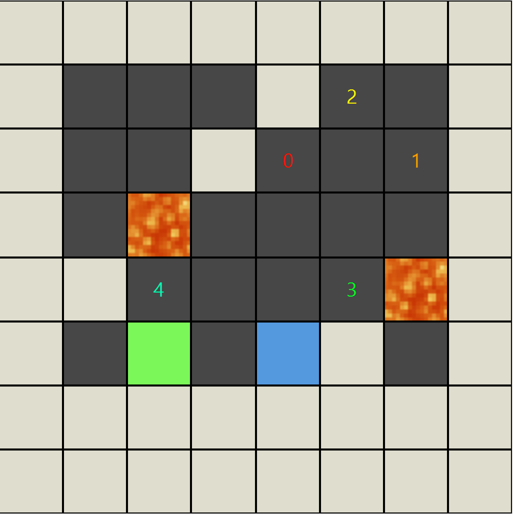

# Ice Sliding Puzzle Solver

## The Program
Program ini menghasilkan solusi untuk permainan Ice Sliding Puzzle. Ice Sliding Puzzle adalah permainan logika di mana pemain harus menggerakkan karakter dari titik awal
menuju titik keluar di atas permukaan es yang licin. Pin (dalam visualisasi warna biru) hanya dapat
bergerak secara horizontal atau vertikal, namun karena permukaan licin, karakter tidak akan berhenti
bergerak sampai menabrak dinding atau rintangan (dalam visualisasi warna putih).
Program ini memiliki 3 pendekatan algoritma untuk menyelesaikan puzzle ini yakni UCS (Uniform Cost Search), GBFS (Greedy-Best First Search), dan A*.

## Running it
- make sure you have [java 17](https://www.oracle.com/java/technologies/javase/jdk17-archive-downloads.html) or newer installed
- Compile and run using [maven](https://maven.apache.org/install.html) with ```mvn clean compile javafx:run```
- Or using the jar file in [./bin](./bin)
## Me
| Nama | NIM |
| ----------- | ----------- |
| I Gusti Ngurah Alit Dharma Yudha | 13524072 |
